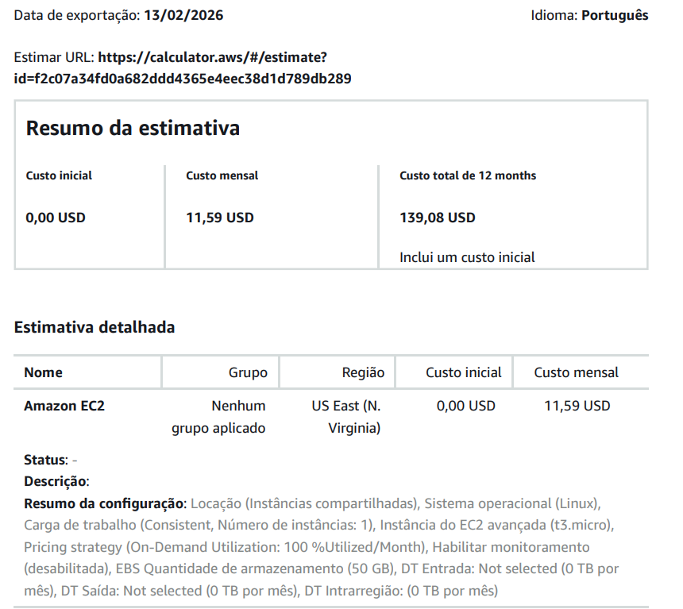
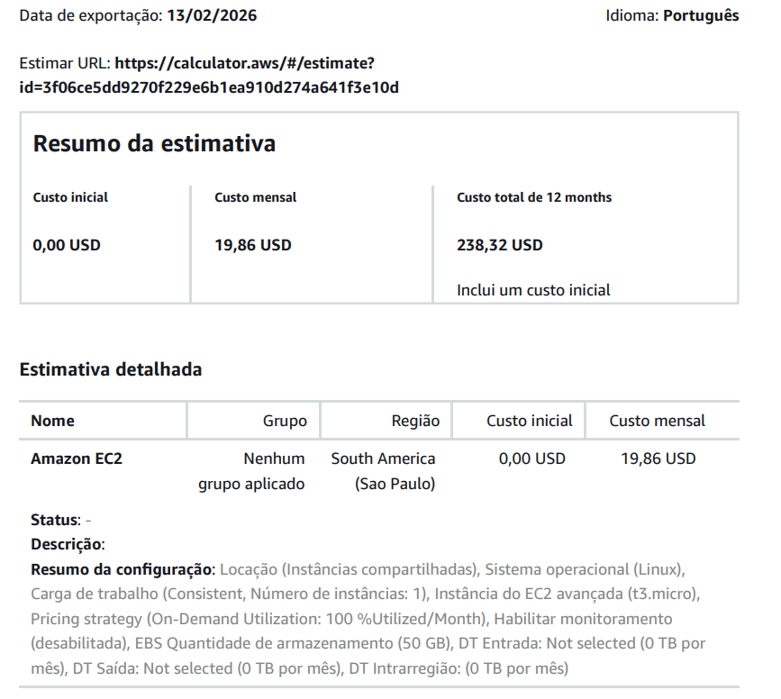
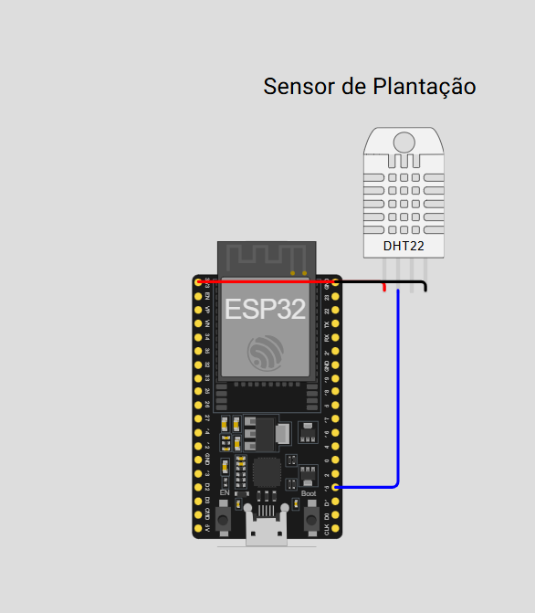

# FIAP - Faculdade de Informática e Administração Paulista

 

# 🚜 FarmTech Solutions - Previsão de Safra com IA
> **Projeto:** Fase 5 - Machine Learning & Cloud Computing (FIAP)

## 👨‍🌾 Integrantes do Grupo
* **Nome:** João Pedro Santos Azevedo
* **RM:** 566701

---

## 📋 Descrição do Projeto
Neste projeto, atuamos como consultores da **FarmTech Solutions** para uma fazenda de médio porte. Nosso objetivo foi analisar dados climáticos e de solo para prever o rendimento das culturas agrícolas.

Utilizamos técnicas de **Machine Learning** para:
1.  **Agrupar (Clusterização):** Identificar padrões climáticos e de produtividade.
2.  **Prever (Regressão):** Estimar quantas toneladas por hectare serão colhidas baseando-se em chuva, temperatura e umidade.

## 🛠️ Tecnologias Utilizadas
* **Python 3.x**
* **Pandas & NumPy:** Manipulação de dados.
* **Seaborn & Matplotlib:** Visualização gráfica.
* **Scikit-Learn:** Algoritmos de Machine Learning (K-Means, Random Forest, SVR, etc).

## 📊 Estrutura do Notebook
O desenvolvimento foi dividido em 5 etapas principais dentro do arquivo `.ipynb`:
1.  **Análise Exploratória (EDA):** Entendimento das variáveis.
2.  **Clusterização (K-Means):** Segmentação das safras.
3.  **Detecção de Outliers:** Limpeza de dados discrepantes.
4.  **Pré-processamento:** Tratamento de variáveis categóricas (One-Hot Encoding).
5.  **Modelagem Preditiva:** Comparação entre 5 algoritmos de regressão.

---

## 🎥 Vídeo Demonstrativo (Entrega 1)
Confira a explicação detalhada do código e dos insights gerados:
> **https://youtu.be/hTuJxgIk0rg**

---

## 🚀 Como Executar
1.  Clone este repositório.
2.  Instale as dependências: `pip install pandas numpy seaborn scikit-learn`
3.  Execute o arquivo `JoaoPedroSantosAzevedo_rm566701_pbl_fase5.ipynb` no VS Code ou Jupyter Notebook.

---

---
# ☁️ Entrega 2: Arquitetura em Nuvem (AWS)

## 1. Comparativo de Custos (AWS Calculator)
Realizamos a cotação de uma instância **EC2 (Linux, 2 vCPUs, 1 GiB RAM, 50GB Armazenamento)** para hospedar nossa API.

### 🇺🇸 Cenário 1: Virgínia do Norte (EUA)
* **Custo Mensal Estimado:** $ 11.59 USD
* **Vantagem:** Menor custo financeiro.

### 🇧🇷 Cenário 2: São Paulo (Brasil)
* **Custo Mensal Estimado:** $ 19.86 USD
* **Vantagem:** Menor latência e conformidade legal.

## 2. Decisão Arquitetural e Justificativa
**Escolha Final:** Região **São Paulo (sa-east-1)**.

Apesar de ser mais cara que a opção americana (diferença de aprox. **71%**), a escolha técnica recai sobre o Brasil devido a dois fatores críticos mencionados no projeto:

1.  **Latência (Velocidade):** O enunciado exige "acessar rapidamente os dados dos sensores". Servidores fisicamente próximos à fazenda (Brasil) garantem o menor tempo de resposta (ping) possível para aplicações de tempo real.
2.  **Soberania de Dados (Legal):** O projeto cita "restrições legais para armazenamento no exterior". Isso remete à **LGPD** e normas do agronegócio que podem exigir que dados sensíveis não cruzem fronteiras internacionais.

## 🎥 Vídeo Demonstrativo 2 (Cloud)
Confira a simulação de custos na AWS Calculator:
> **https://youtu.be/PHSd9TUwNEU**

# 🌟 Ir Além: Monitoramento Inteligente (IoT)

## 🎯 Objetivo e Conexão com o Negócio
Para fechar o ciclo de dados da **FarmTech Solutions**, desenvolvemos um protótipo funcional de IoT (Internet das Coisas). O objetivo é coletar dados reais no campo para alimentar futuramente os modelos de Machine Learning desenvolvidos na Fase 1.

### 📡 Sensores Escolhidos:
1.  **DHT22 (Digital):** Monitora **Temperatura e Umidade** com precisão.
    * *Justificativa:* Variáveis críticas para o cálculo de rendimento da safra e prevenção de fungos.
2.  **LDR (Analógico com Resistor):** Monitora a **Luminosidade**.
    * *Justificativa:* Essencial para medir a incidência solar diária (fotoperíodo), impactando diretamente na fotossíntese.

---

## 🛠️ Arquitetura da Solução
O sistema é controlado por um **ESP32** conectado via Wi-Fi. Implementamos uma arquitetura híbrida de visualização para garantir redundância no monitoramento:

### 1. Web Server (Dashboard HTML)
O ESP32 hospeda uma página web responsiva (HTML/CSS) acessível via navegador.
* **Funcionalidade:** Exibe cards coloridos com os valores em tempo real.
* **Atualização:** A página recarrega automaticamente (meta refresh) a cada 5 segundos.

### 2. Serial Monitor Dashboard
Para diagnósticos rápidos e validação no simulador, o sistema também projeta um painel formatado no Console Serial.
* **Funcionalidade:** Exibe alertas de risco (ex: "Temperatura Alta!") e status textual da luz (Ensolarado/Nublado/Escuro).

---

## 📸 Evidências de Funcionamento
Abaixo, o circuito montado no simulador Wokwi rodando o Web Server:

---

## 🎥 Vídeo Demonstrativo: Ir Além
Confira a demonstração prática do sistema conectando ao Wi-Fi, gerando o IP e exibindo os dados no navegador e no serial:
> **https://youtu.be/IJieQxcw6wI**

---

## 💻 Como rodar este código
O código fonte completo (`.ino`) está disponível neste repositório.
1.  Abra o arquivo no **Wokwi** ou **Arduino IDE**.
2.  Certifique-se de instalar as bibliotecas `DHT sensor library` e `Adafruit Unified Sensor`.
3.  Configure as credenciais de Wi-Fi (SSID/Senha).

---
---
# 🧠 Ir Além 2: Classificação de Saúde com Machine Learning

## 🎯 Objetivo do Projeto
Desenvolver um sistema inteligente capaz de diagnosticar a saúde de uma plantação de **Alface Americana** em tempo real. O sistema coleta dados microclimáticos e utiliza um modelo de IA para classificar o ambiente como **"Saudável"** ou **"Não Saudável"**.

## 🛠️ Tecnologias e Arquitetura
1.  **Hardware (Edge):** ESP32 + Sensor DHT22.
2.  **Software (Backend):** Python + Scikit-Learn (Decision Tree).
3.  **Fluxo de Dados:**
    * O sensor lê Temperatura e Umidade.
    * O ESP32 processa e envia via Serial.
    * O modelo de ML recebe os dados e realiza a inferência.

## 🥬 Justificativa Técnica (Sensor e Cultura)
Escolhemos a cultura da **Alface (Lactuca sativa)** pois ela é extremamente sensível a variações microclimáticas.
* **Sensor Escolhido:** DHT22 (Temperatura e Umidade).
* **Motivo:** A alface exige temperaturas entre **20°C e 30°C** e umidade acima de **40%**.
    * *Calor excessivo (>30°C):* Causa "queima da borda" (tip burn) e espigamento precoce.
    * *Baixa umidade (<40%):* Causa desidratação e murcha.
    * Nosso modelo de IA foi treinado especificamente para detectar essas zonas de perigo.

## 🚀 Como Executar a Classificação
1.  Monte o circuito no Wokwi ou Hardware Real conforme o diagrama.
2.  Abra o Serial Monitor para visualizar as leituras em tempo real.
3.  Execute o notebook `classificador_saude_plantas.ipynb`.
4.  Insira os valores lidos no sensor quando solicitado pelo script Python.
5.  **Resultado:** O sistema informará instantaneamente o diagnóstico da planta.

### 🎥 Demonstração Funcional
Confira o vídeo do sistema classificando dados em tempo real:
▶️ **https://youtu.be/jAVa0jgtFRI**

### Link do GitHub

Confira o link do Github:

**https://github.com/joaostazevedo172/farm-tech_solutions-fase05**

## 📋 Licença

<a property="dct:title" rel="cc:attributionURL" href="https://github.com/agodoi/template">MODELO GIT FIAP</a> por <a rel="cc:attributionURL dct:creator" property="cc:attributionName" href="https://fiap.com.br">Fiap</a> está licenciado sobre <a href="http://creativecommons.org/licenses/by/4.0/?ref=chooser-v1" target="_blank" rel="license noopener noreferrer" style="display:inline-block;">Attribution 4.0 International</a>.

